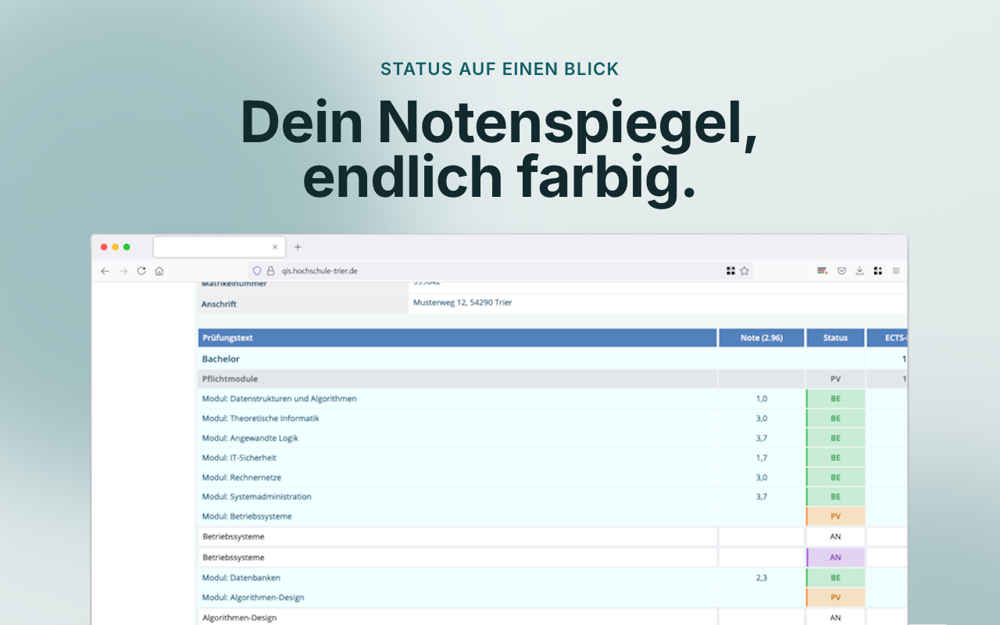
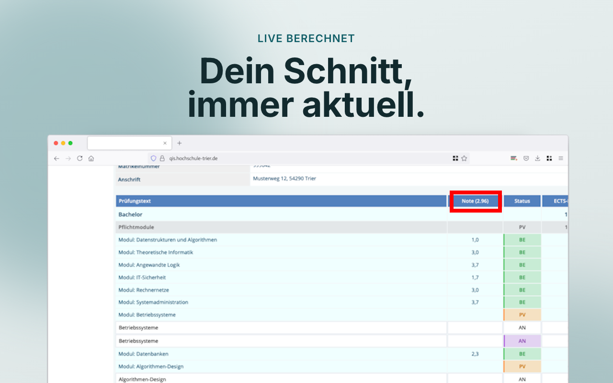
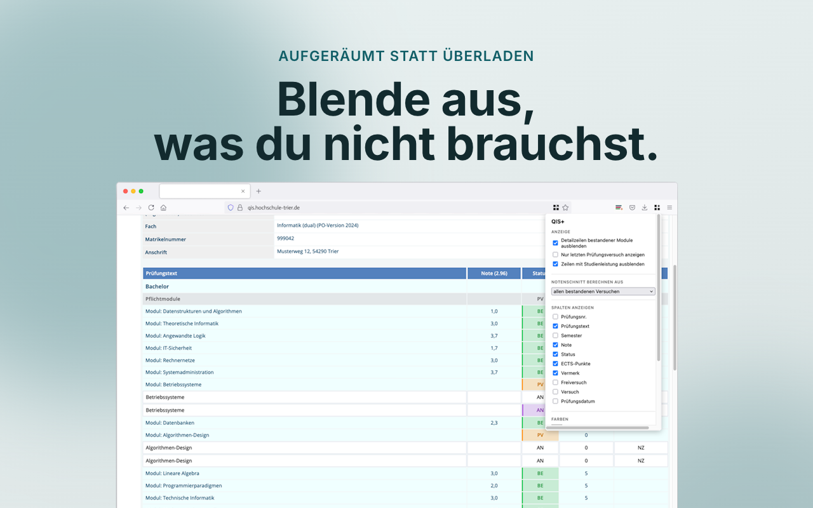
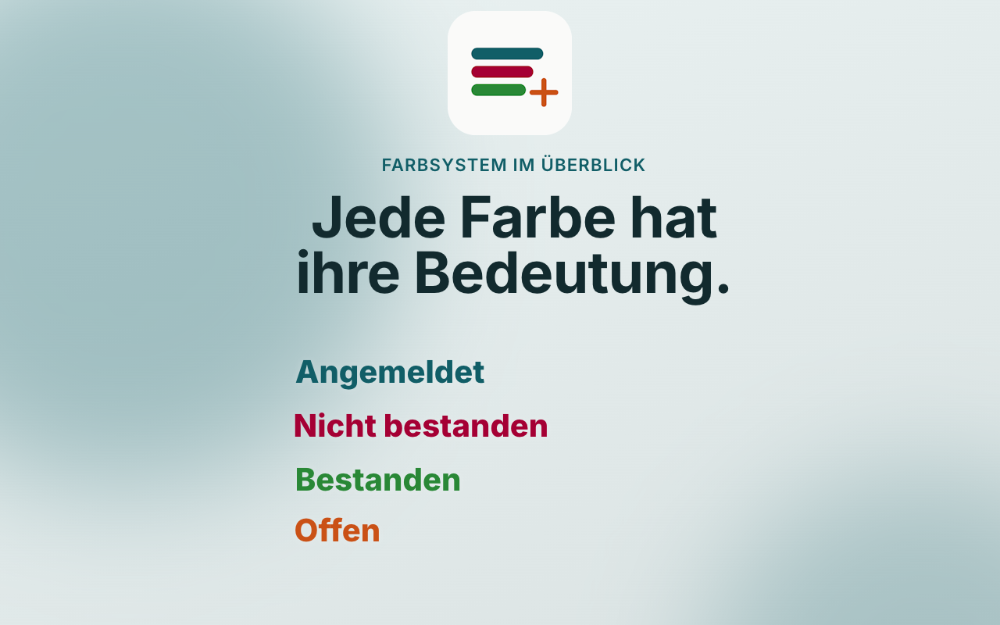

# QIS+ — Firefox Add-on Beschreibung

Entwurf für den Eintrag auf [addons.mozilla.org](https://addons.mozilla.org). Text hier pflegen und beim Einreichen in die jeweiligen Felder im AMO-Formular kopieren.

## Kurzbeschreibung (Summary, max. ~250 Zeichen)

Endlich Durchblick im QIS-Portal der Hochschule Trier: farbcodierter Notenspiegel, Live-Notenschnitt und individuell anpassbare Ansicht.

## Ausführliche Beschreibung

QIS+ räumt den Notenspiegel im QIS-Portal der Hochschule Trier auf, färbt ihn ein und berechnet deinen Notenschnitt live — direkt im Browser, ganz ohne zusätzliche Anmeldung oder Datenübertragung.

**Funktionen:**

- **Farbcodierter Status:** Jedes Modul ist sofort erkennbar: *bestanden*, *offen*, *angemeldet* oder *durchgefallen* — inklusive Klartext-Tooltip.
- **Live-Notenschnitt:** ECTS-gewichtet direkt im Tabellenkopf (`Note (2.34)`). Konfigurierbar: aus allen Versuchen, nur dem letzten oder nur der besten Note.
- **„NEU"-Badge:** Sobald eine neue Note eingetragen wurde, erhält das Modul automatisch ein Badge. Kein manuelles Vergleichen mehr.
- **„Warten"-Markierung:** Prüfung geschrieben, aber noch keine Note? QIS+ markiert sie automatisch.
- **Individuelles Aufräumen:** Detailzeilen bestandener Module, frühere Versuche, Studienleistungen oder ganze Spalten lassen sich flexibel ausblenden.
- **Eigene Farbschemata:** Alle Statusfarben lassen sich im Popup anpassen und jederzeit zurücksetzen.
- **Prüfungsanmeldung:** Bereits bestandene Module werden auf der Anmeldeseite direkt grün hervorgehoben.

Alle Einstellungen erreichst du über das QIS+-Symbol in der Browser-Werkzeugleiste. Änderungen greifen nach dem Neuladen der QIS-Seite.

**Datenschutz:** QIS+ erhebt, speichert und überträgt keinerlei persönliche Daten. Alle Einstellungen sowie der lokale Notenstand für das NEU-Badge verbleiben ausschließlich lokal auf deinem Gerät.

QIS+ ist ein unabhängiges Open-Source-Projekt und steht in keiner offiziellen Verbindung zur Hochschule Trier.

## Screenshots

## Berechtigungen (für die AMO-Reviewer-Notizen)

- `storage`: Speichert die Einstellungen (Farben, Filter, Notenschnitt-Modus) sowie den lokalen Notenstand für das NEU-Badge — ausschließlich lokal auf dem Gerät.
- `*://qis.hochschule-trier.de/*`: Wird benötigt, um den Notenspiegel und die Prüfungsanmeldung auf dieser Domain zu lesen und farblich/inhaltlich anzupassen. Es werden keine Daten von der Seite an Dritte übertragen.

## Support & Quellcode

- Quellcode: https://github.com/mxsrwn23/qis-extension
- Issues/Feedback: https://github.com/mxsrwn23/qis-extension/issues
- Lizenz: MIT
